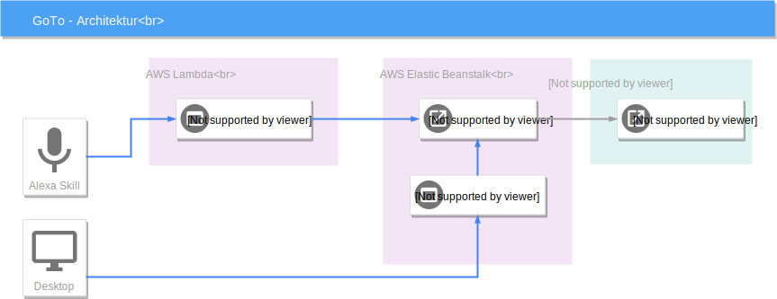

# Problem Statement

* Mitfahrten nicht einfach zu finden
* Keine einheitliche Suche mit Öffis

# Lösungsansatz

---

* Alexa-Skill: Frontend für die Suche
* Angular-App: Frontend für das Eintragen der Fahrten
* ASP.NET Core: Backend für das Speichern der Fahrten und Suchen nach Öffi-Verbindungen

# Ergebnisse

# Demo

**Web-Oberfläche**

---

 aufrufen](goto-client-welcome.png)

---

