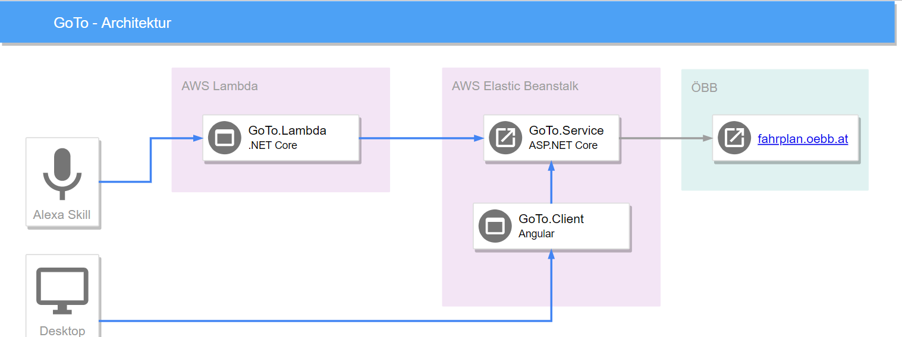

# Problem

Mitfahrten sind nicht einfach zu finden, da sie nur in einem kleineren Kreis bekannt sind oder nur wenige öffentlich bekannt gegeben werden (Facebook FH Mitfahrbörse). 

Keine vereinte Suche mit öffentlichen Verkehrsmittel, wenn es zum aktuellen Zeitpunkt keine Mitfahrmöglichkeit angeboten werden.

# Lösungsansatz

Ein Alexa-Skill dient als zentraler Punkt zur Abfrage von Mitfahremöglichkeiten und öffentlichen Verbindungen. Dieser greift auf einen eigenen Service zu, dass die Suche nach Fahrten übernimmt. Dieses Service stellt auch eine Web-Oberfläche zur Verfugung, über der neue Mitfahrten eingetragen werden können. All diese Applikationen sollen in der Cloud gehostet werden, damit diese leicht erreichbar sind.



# Implementierung

Folgende Applikationen wurden implementiert:

| Name         | Technologie | Kurzbeschreibung                                                        |
| ------------ | ----------- | ----------------------------------------------------------------------- |
| GoTo.Service | .NET Core   | Backend für das Speichern der Fahrten und Suchen nach Öffi-Verbindungen |
| GoTo.Lambda  | .NET Core   | Backend des Alexa-Skill                                                 |
| GoTo.Client  | Angular     | Frontend für das Eintragen der Fahrten                                  |
| GoTo.Alexa   | Alexa-Skill | Frontend für die Suche                                                  |

## GoTo.Service

Die zentrale Schnittselle von *GoTo* ist mithilfe von ASP.NET Core implementiert. Der Service wird auf *AWS Elastic Beanstalk* deployt als Docker-Container. Die Mitfahrten werden *In-Memory* gespeichert, da sie nur bis zur ihrer Startzeit gültig sind und danach nicht mehr gewählt werden können.

Der Service stellt auch den GoTo.Client bereit und dieser ist unter `/` verfügbar. Die REST-Methoden sind unter `/api` verfügbar und die Swagger UI ist unter `/swagger` erreichbar.

### Architektur

```{=latex}
\begin{figure}[h!]
    \includegraphics{goto-service-arch.png}
    \caption{Klassendiagram von GoTo.Service}
\end{figure}
```

`\pagebreak`{=latex}

### REST-Schnittstelle


### Deployment

Das Deployment auf *AWS Bean Stalk* erfolgt in folgenden Schritten:

1. Bauen des GoTo.Service Projekt in Produktionsmodus
2. Bauen des GoTo.Client Projekts in Produktionsmodus
3. Kopiere GoTo.Service in `dist/app`
4. Kopiere GoTo.Client in `dist/app/wwwroot`
5. Füge einfaches Dockerfile zum Starten von GoTo.Serivce hinzu
6. In ein ZIP-Archiv einpacken (Für AWS **muss** der Separator für Verzeichnisse gleich `/` sein, daher wird `zip` verwendet.)
7. Deploy mithilfe von `eb deploy`

## GoTo.Lambda

GoTo.Lambda übernimmt die Benutzerführung des Alexa-Skills und stellt Abfragen an GoTo.Service um an Ortsinformationen zu gelangen oder um aktuelle Verbindungen zu ermitteln. 

### Architektur

```{=latex}
\begin{figure}[h!]
    \centering
    \includegraphics[width=0.75\linewidth]{goto-lambda-arch.png}
    \caption{Klassendiagram von GoTo.Lambda}
\end{figure}
```

`\pagebreak`{=latex}

### Anbindung an GoTo.Service

Die Anbindung erfolgt über simple HTTP-Anfragen, die intern aber nicht gecacht werden. Das heißt, dass die Anfragen von Orten immer neu ausgeführt werden. Der Host kann über die Properties eingestellt werden.

## GoTo.Alexa

GoTo.Alexa ist ein Custom Alexa Skill, der als Backend GoTo.Lambda verwendet. Es wird nur die Sprache Deutsch unterstützt.

Um den Startort einfach bestimmen zu können, wird der Zugriff auf die *Location Services* benötigt. Sollte der Benutzer den Startort nicht angeben, werden sein akuteller Standort verwendet. Der Benutzer kann aber auch ohne diese Berechtigung den Skill benützen, in dem er den Startort explizit angibt ("Wie komme ich von Hagenberg nach Linz?").

Zum Behandeln von Fehlern werden intern Zähler verwendet, die in der Session gespeichert werden. Sollte zum Beispiel das Abfragen eines Ortes 2-mal fehlschlagen, wird die Session abgebrochen und der Benutzer verständigt.

Das Skill-Projekt wurde mithilfe der `ask`-CLI geclont.

### Intents

* TripSearchIntent
  * Slot `Source` (AMAZON.City)
  * Slot `Destination` (AMAZON.City)
* SpecifyLocationIntent
  * Slot `Location` (AMAZON.City)

### Permissions

* Location Services
  * Um den Startort zu ermitteln
  * Ist nicht unbedingt erforderlich, da der Benutzer auch den Startort selbst angeben kann

## GoTo.Client

GoTo.Client ist eine einfach-gehaltene Angular-App zum Hinzufügen der Mitfahrten. Beim Start werden aktuell angebotene Fahrten angezeigt und es kann über einen Button eine neue Fahrt angelegt werden. Für das Styling wurde *Bootstrap* verwendet im Kombination mit *ng-bootstrap* für eine bessere Integration mit Angular.

Zum Abfragen des GoTo.Service wird ein von *swagger-codegen* generierter Client verwendet siehe hierfür Abschnitt Anbindung an GoTo.Service.

### Architektur

```{=latex}
\begin{figure}[h!]
    \includegraphics[width=0.8\linewidth]{goto-client-arch.png}
    \caption{Klassendiagram von GoTo.Client}
\end{figure}
```

### Anbindung an GoTo.Service

Der GoTo.Service erzeugt beim Bauen eine swagger.json, aus der dann ein Client generiert werden kann. Um dies möglichs einfach zu machen, wird Docker benützt um *swagger-codegen* zu starten. Dies übernimmt das Skript `GoTo.Client/Update-ApiClient.ps1`.

Der generierte Client ist dann unter `GoTo.Client/src/api-client` verfügbar und dieser kann direkt in Angular verwendet werden, da ein eigenes Angular-Modul generiert wird.

Der benützte Server ist im *environment* hinterlegt und ist beim Entwickeln gesetzt auf den lokalen Host und im Live-Betrieb ist diese auf `goto.eu-west-1.elasticbeanstalk.com` gesetzt.