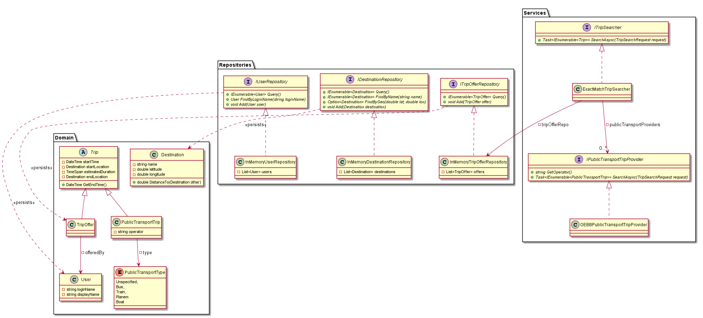
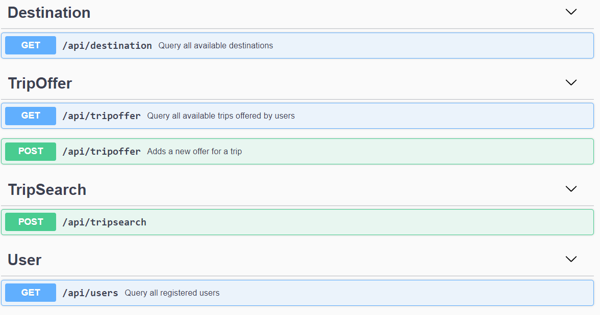

# GoTo.Service

Die zentrale Schnittselle von *GoTo* ist mithilfe von ASP.NET Core implementiert. Der Service wird auf *AWS Elastic Beanstalk* deployt als Docker-Container. 

## Architektur

## REST-Schnittstelle

## Deployment

# GoTo.Lambda

## Architektur

# GoTo.Alexa

## Intents

## Permissions

# GoTo.Client

## Architektur

## Anbindung an GoTo.Service