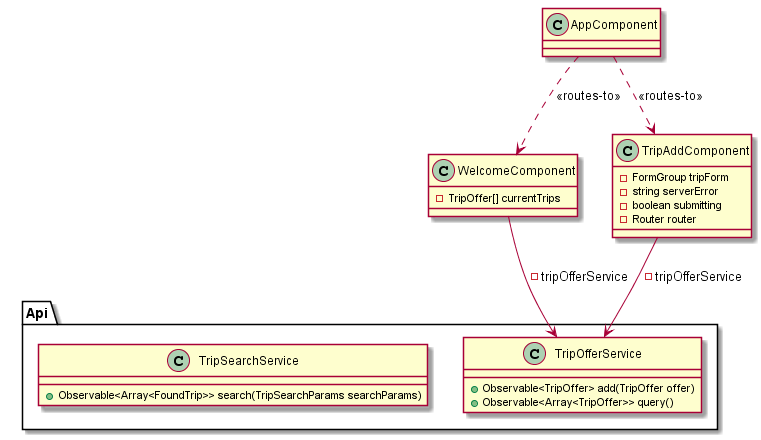

# GoTo.Service

Die zentrale Schnittselle von *GoTo* ist mithilfe von ASP.NET Core implementiert. Der Service wird auf *AWS Elastic Beanstalk* deployt als Docker-Container. 

## Architektur

## REST-Schnittstelle

## Deployment

# GoTo.Lambda

## Architektur

## Anbindung an GoTo.Service

Die Anbindung erfolgt über simple HTTP-Anfragen, die intern aber nicht gecacht werden.

# GoTo.Alexa

## Intents

## Permissions

# GoTo.Client

Angular

Boostrap

ng-boostrap

## Architektur

## Anbindung an GoTo.Service

Der GoTo.Service erzeugt beim Bauen eine swagger.json, aus der dann ein Client generiert werden kann. Um dies möglichs einfach zu machen, wird Docker benützt um *swagger-codegen* zu starten. Dies übernimmt das Skript `GoTo.Client/Update-ApiClient.ps1`.

Der generierte Client ist dann unter `GoTo.Client/src/api-client` verfügbar und dieser kann direkt in Angular verwendet werden, da ein eigenes Angular-Modul generiert wird.

Der benützte Server ist im *environment* hinterlegt und ist beim Entwickeln gesetzt auf den lokalen Host und im Live-Betrieb ist diese auf `goto.eu-west-1.elasticbeanstalk.com` gesetzt.